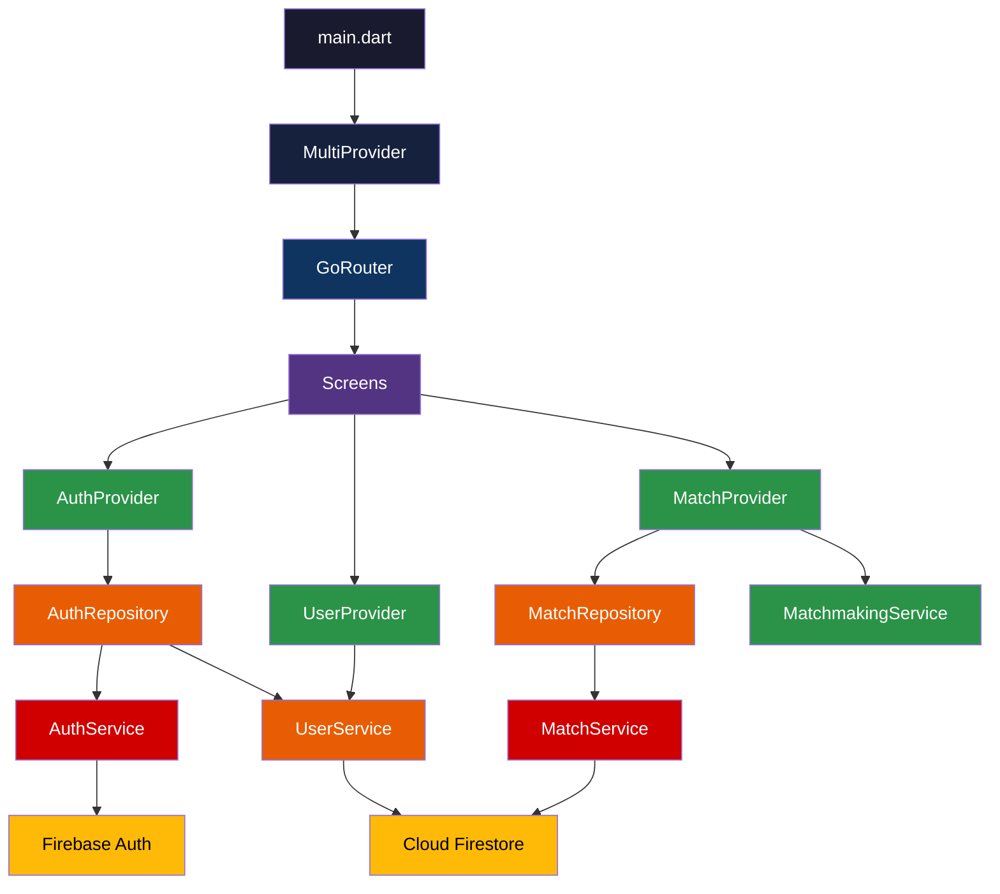

# ineTeam — Complete Sports Matchmaking App

Build a production-quality Flutter mobile app for student sports matchmaking with Firebase backend, clean architecture, premium dark UI, and real-time features.

## Current State

The project is an initialized Flutter app with:
- Firebase already configured (Auth + Firestore + firebase_options.dart)
- 3 basic pages in `lib/pages/` (login, home, landing) — **will be replaced**
- Dependencies: `firebase_core`, `firebase_auth`, `cloud_firestore`
- SDK: `^3.9.2`, Material 3 enabled

## User Review Required

> [!IMPORTANT]
> **State Management: Provider** — I'll use Provider for state management. It's the simplest, officially recommended by the Flutter team, and ideal for this project's scope. No boilerplate overhead like Bloc, and easier to understand for academic purposes.

> [!IMPORTANT]
> **Existing code will be replaced.** The current `lib/pages/` files (login_page.dart, home_page.dart, myhomepage.dart) contain duplicate `main()` functions, hardcoded French text, and no architecture. They will be deleted and rebuilt from scratch inside the new structured `lib/` layout.

> [!WARNING]
> **New dependencies** will be added to `pubspec.yaml`: `provider`, `go_router`, `intl`, `uuid`, `google_fonts`, `cached_network_image`, `image_picker`, `firebase_storage`. These are all stable, widely-used packages.

> [!IMPORTANT]
> **Firebase Storage** is needed for profile picture uploads. You'll need to enable Firebase Storage in your Firebase console if not already done.

## Proposed Changes

The entire `lib/` directory will be restructured. Here's the complete file plan:

---

### Core Layer

Constants, themes, utilities, and routing shared across the entire app.

#### [NEW] [app_theme.dart](file:///c:/Users/safar/MyProjects-User/ineTeam/lib/core/theme/app_theme.dart)
- Premium dark theme with green accent colors matching sports branding
- Custom `ColorScheme`, typography using Google Fonts (Inter/Outfit)
- Consistent card styles, input decorations, button themes
- Light mode support (togglable)

#### [NEW] [app_constants.dart](file:///c:/Users/safar/MyProjects-User/ineTeam/lib/core/constants/app_constants.dart)
- Sport types enum: `Football`, `Basketball`, `Volleyball`, `TableTennis`
- Skill levels enum: `Beginner`, `Intermediate`, `Advanced`
- Frequency enum: `Casual`, `Regular`, `Competitive`
- Match status enum: `Open`, `Full`, `Completed`
- Default max players per sport, Firestore collection names

#### [NEW] [app_router.dart](file:///c:/Users/safar/MyProjects-User/ineTeam/lib/core/router/app_router.dart)
- GoRouter configuration with named routes
- Routes: `/splash`, `/login`, `/signup`, `/profile-setup`, `/home`, `/match/:id`, `/create-match`, `/profile`
- Auth-guarded routes (redirect to login if unauthenticated)
- Shell route for bottom navigation

#### [NEW] [validators.dart](file:///c:/Users/safar/MyProjects-User/ineTeam/lib/core/utils/validators.dart)
- Email validation (with INPT domain check optional)
- Password strength validation
- Match creation field validation

#### [NEW] [helpers.dart](file:///c:/Users/safar/MyProjects-User/ineTeam/lib/core/utils/helpers.dart)
- Date formatting helpers
- Skill level display helpers
- Sport icon mapping

---

### Data Layer — Models

Dart model classes with Firestore serialization.

#### [NEW] [user_model.dart](file:///c:/Users/safar/MyProjects-User/ineTeam/lib/data/models/user_model.dart)
```dart
class UserModel {
  final String uid;
  final String name;
  final String email;
  final String? profilePictureUrl;
  final List<String> sports;        // ['Football', 'Basketball']
  final int skillLevel;             // 1-100 numeric rating
  final String frequency;           // 'casual' | 'regular' | 'competitive'
  final List<String> createdMatches;
  final List<String> joinedMatches;
  final DateTime createdAt;
  // toMap(), fromMap(), copyWith()
}
```

#### [NEW] [match_model.dart](file:///c:/Users/safar/MyProjects-User/ineTeam/lib/data/models/match_model.dart)
```dart
class MatchModel {
  final String id;
  final String creatorId;
  final String creatorName;
  final String sport;
  final String location;
  final DateTime dateTime;
  final int maxPlayers;
  final List<String> playerIds;
  final String? description;
  final int? minSkill;
  final int? maxSkill;
  final String status;              // 'open' | 'full' | 'completed'
  final DateTime createdAt;
  // toMap(), fromMap(), copyWith()
}
```

---

### Data Layer — Services

Direct Firebase interaction layer.

#### [NEW] [auth_service.dart](file:///c:/Users/safar/MyProjects-User/ineTeam/lib/data/services/auth_service.dart)
- `signUp(email, password)` → creates Firebase Auth user
- `signIn(email, password)` → signs in
- `signOut()` → signs out
- `currentUser` getter
- `authStateChanges` stream
- Full error handling with custom exception types

#### [NEW] [user_service.dart](file:///c:/Users/safar/MyProjects-User/ineTeam/lib/data/services/user_service.dart)
- `createUserProfile(UserModel)` → writes to `users/{uid}`
- `getUserProfile(uid)` → reads user doc
- `updateUserProfile(uid, data)` → updates user doc
- `uploadProfilePicture(uid, file)` → Firebase Storage upload
- `userProfileStream(uid)` → real-time stream

#### [NEW] [match_service.dart](file:///c:/Users/safar/MyProjects-User/ineTeam/lib/data/services/match_service.dart)
- `createMatch(MatchModel)` → writes to `matches/{id}`
- `getMatches({sport?, date?, skillRange?})` → filtered query
- `matchesStream()` → real-time stream of open matches
- `joinMatch(matchId, userId)` → array union + status check
- `leaveMatch(matchId, userId)` → array remove
- `updateMatchStatus(matchId, status)`
- `getMatchById(matchId)` → single doc read
- `matchStream(matchId)` → real-time single match stream
- `getUserMatches(userId)` → matches where user is a player

---

### Data Layer — Repositories

Abstraction over services with business logic.

#### [NEW] [auth_repository.dart](file:///c:/Users/safar/MyProjects-User/ineTeam/lib/data/repositories/auth_repository.dart)
- Wraps AuthService + UserService
- On signup: creates auth user AND Firestore profile doc
- Returns friendly error messages

#### [NEW] [match_repository.dart](file:///c:/Users/safar/MyProjects-User/ineTeam/lib/data/repositories/match_repository.dart)
- Wraps MatchService with validation
- Prevents joining full matches
- Prevents duplicate joins
- Handles match creation with creator auto-join
- Updates user's `createdMatches`/`joinedMatches` arrays

---

### Feature Providers (State Management)

#### [NEW] [auth_provider.dart](file:///c:/Users/safar/MyProjects-User/ineTeam/lib/features/auth/auth_provider.dart)
- `AuthProvider extends ChangeNotifier`
- Properties: `user`, `isLoading`, `errorMessage`, `isAuthenticated`
- Methods: `signUp()`, `signIn()`, `signOut()`, `clearError()`
- Listens to `authStateChanges` for persistent sessions

#### [NEW] [user_provider.dart](file:///c:/Users/safar/MyProjects-User/ineTeam/lib/features/profile/user_provider.dart)
- `UserProvider extends ChangeNotifier`
- Properties: `currentUserProfile`, `isLoading`
- Methods: `loadProfile()`, `updateProfile()`, `uploadPicture()`
- Real-time stream subscription to user doc

#### [NEW] [match_provider.dart](file:///c:/Users/safar/MyProjects-User/ineTeam/lib/features/matches/match_provider.dart)
- `MatchProvider extends ChangeNotifier`
- Properties: `matches`, `filteredMatches`, `isLoading`, `selectedSportFilter`, `selectedMatch`
- Methods: `loadMatches()`, `createMatch()`, `joinMatch()`, `leaveMatch()`, `filterBySport()`, `filterByDate()`, `searchMatches(query)`
- Real-time stream subscription to matches collection
- Team balancing algorithm

#### [NEW] [matchmaking_service.dart](file:///c:/Users/safar/MyProjects-User/ineTeam/lib/features/matches/matchmaking_service.dart)
- `balanceTeams(List<UserModel> players)` → returns two balanced teams
- Algorithm: sort by skill, alternating draft assignment
- Returns `TeamBalanceResult` with teams and skill differential

---

### Presentation Layer — Screens

#### [NEW] [splash_screen.dart](file:///c:/Users/safar/MyProjects-User/ineTeam/lib/presentation/screens/splash_screen.dart)
- Animated ineTeam logo with fade-in + scale
- Auto-redirects based on auth state after 2s
- Green gradient background

#### [NEW] [login_screen.dart](file:///c:/Users/safar/MyProjects-User/ineTeam/lib/presentation/screens/auth/login_screen.dart)
- Email + password fields with validation
- "Sign In" button with loading state
- Link to signup screen
- Error display via SnackBar
- Sports-themed illustration/icon

#### [NEW] [signup_screen.dart](file:///c:/Users/safar/MyProjects-User/ineTeam/lib/presentation/screens/auth/signup_screen.dart)
- Name + email + password + confirm password
- Form validation
- Link to login screen
- Auto-navigates to profile setup on success

#### [NEW] [profile_setup_screen.dart](file:///c:/Users/safar/MyProjects-User/ineTeam/lib/presentation/screens/profile/profile_setup_screen.dart)
- Sport selection (multi-select chips)
- Skill level slider (1-100 with labels)
- Frequency radio buttons
- Profile picture picker (optional)
- "Complete Setup" button

#### [NEW] [home_screen.dart](file:///c:/Users/safar/MyProjects-User/ineTeam/lib/presentation/screens/home/home_screen.dart)
- App bar with ineTeam branding
- Horizontal sport filter chips (All / Football / Basketball / etc.)
- Match list with real-time StreamBuilder
- Search bar
- FAB → Create Match
- Pull-to-refresh
- Empty state illustration

#### [NEW] [match_detail_screen.dart](file:///c:/Users/safar/MyProjects-User/ineTeam/lib/presentation/screens/match/match_detail_screen.dart)
- Full match info (sport, location, datetime, description)
- Player list with skill indicators
- Join/Leave button (contextual)
- Team suggestion view (when match is full)
- Creator can edit/delete
- Real-time player count updates

#### [NEW] [create_match_screen.dart](file:///c:/Users/safar/MyProjects-User/ineTeam/lib/presentation/screens/match/create_match_screen.dart)
- Sport dropdown
- Location text field
- Date & time pickers
- Max players stepper
- Description field (optional)
- Skill range slider (optional)
- Form validation
- Submit with loading state

#### [NEW] [profile_screen.dart](file:///c:/Users/safar/MyProjects-User/ineTeam/lib/presentation/screens/profile/profile_screen.dart)
- User info display (avatar, name, email)
- Stats: matches created, matches joined
- Sport badges
- Skill level indicator
- Edit profile button
- Dark mode toggle
- Logout button

#### [NEW] [my_matches_screen.dart](file:///c:/Users/safar/MyProjects-User/ineTeam/lib/presentation/screens/match/my_matches_screen.dart)
- Tabs: "Created" / "Joined"
- List of user's matches with status indicators
- Tap to navigate to match detail

#### [NEW] [main_shell.dart](file:///c:/Users/safar/MyProjects-User/ineTeam/lib/presentation/screens/main_shell.dart)
- Scaffold with BottomNavigationBar
- Tabs: Home (🏠) / My Matches (📋) / Profile (👤)
- GoRouter ShellRoute integration

---

### Presentation Layer — Widgets

#### [NEW] [match_card.dart](file:///c:/Users/safar/MyProjects-User/ineTeam/lib/presentation/widgets/match_card.dart)
- Elevated card with sport icon, title, location, time
- Player count indicator (e.g., "5/10 players")
- Progress bar showing fill percentage
- Status badge (Open/Full/Completed)
- Tap to navigate to detail
- Subtle hover/press animation

#### [NEW] [sport_chip.dart](file:///c:/Users/safar/MyProjects-User/ineTeam/lib/presentation/widgets/sport_chip.dart)
- Filterable chip with sport icon + name
- Selected/unselected states with animation
- Custom colors per sport

#### [NEW] [skill_indicator.dart](file:///c:/Users/safar/MyProjects-User/ineTeam/lib/presentation/widgets/skill_indicator.dart)
- Visual skill level bar/badge
- Color-coded (green → yellow → red)

#### [NEW] [player_avatar.dart](file:///c:/Users/safar/MyProjects-User/ineTeam/lib/presentation/widgets/player_avatar.dart)
- Circular avatar with fallback initials
- Skill level ring around it

#### [NEW] [loading_overlay.dart](file:///c:/Users/safar/MyProjects-User/ineTeam/lib/presentation/widgets/loading_overlay.dart)
- Full-screen semi-transparent overlay with spinner
- Used during async operations

#### [NEW] [empty_state.dart](file:///c:/Users/safar/MyProjects-User/ineTeam/lib/presentation/widgets/empty_state.dart)
- Illustration + message for empty lists
- Optional action button

#### [NEW] [team_balance_view.dart](file:///c:/Users/safar/MyProjects-User/ineTeam/lib/presentation/widgets/team_balance_view.dart)
- Two-column team display
- Shows players with skill badges
- Average skill per team
- "Balanced" / "Unbalanced" indicator

---

### Entry Point

#### [MODIFY] [main.dart](file:///c:/Users/safar/MyProjects-User/ineTeam/lib/main.dart)
- Initialize Firebase
- Wrap app with `MultiProvider` (AuthProvider, UserProvider, MatchProvider)
- Use GoRouter for navigation
- Apply custom theme
- Remove old imports

#### [MODIFY] [pubspec.yaml](file:///c:/Users/safar/MyProjects-User/ineTeam/pubspec.yaml)
Add dependencies:
```yaml
provider: ^6.1.2
go_router: ^14.8.1
intl: ^0.20.2
uuid: ^4.5.1
google_fonts: ^6.2.1
cached_network_image: ^3.4.1
image_picker: ^1.1.2
firebase_storage: ^12.4.0
```

#### [DELETE] [login_page.dart](file:///c:/Users/safar/MyProjects-User/ineTeam/lib/pages/login_page.dart)
#### [DELETE] [home_page.dart](file:///c:/Users/safar/MyProjects-User/ineTeam/lib/pages/home_page.dart)
#### [DELETE] [myhomepage.dart](file:///c:/Users/safar/MyProjects-User/ineTeam/lib/pages/myhomepage.dart)

---

## Architecture Diagram



## Firestore Schema

```
users/
  {userId}/
    name: string
    email: string
    profilePictureUrl: string?
    sports: string[]
    skillLevel: int (1-100)
    frequency: string
    createdMatches: string[]
    joinedMatches: string[]
    createdAt: timestamp

matches/
  {matchId}/
    creatorId: string
    creatorName: string
    sport: string
    location: string
    dateTime: timestamp
    maxPlayers: int
    playerIds: string[]
    description: string?
    minSkill: int?
    maxSkill: int?
    status: string ('open' | 'full' | 'completed')
    createdAt: timestamp
```

## Open Questions

> [!IMPORTANT]
> 1. **Should signup be restricted to INPT email addresses** (e.g., `@inpt.ac.ma`)? The existing code references "Email INPT". I can add domain validation if desired.

> [!NOTE]
> 2. **Dark mode as default or toggleable?** I plan to make the default theme a premium dark mode with a toggle in the profile screen. Let me know if you prefer light mode as default.

## Verification Plan

### Automated Tests
- Run `flutter analyze` to check for static analysis issues
- Run `flutter build apk --debug` to verify the app compiles

### Manual Verification
- Launch with `flutter run -d chrome` (web) or `flutter run` (connected device/emulator)
- Test auth flow: signup → profile setup → home
- Test match creation and joining
- Test real-time updates (open two browser tabs)
- Test filters and search
- Test edge cases (join full match, duplicate join, network errors)
