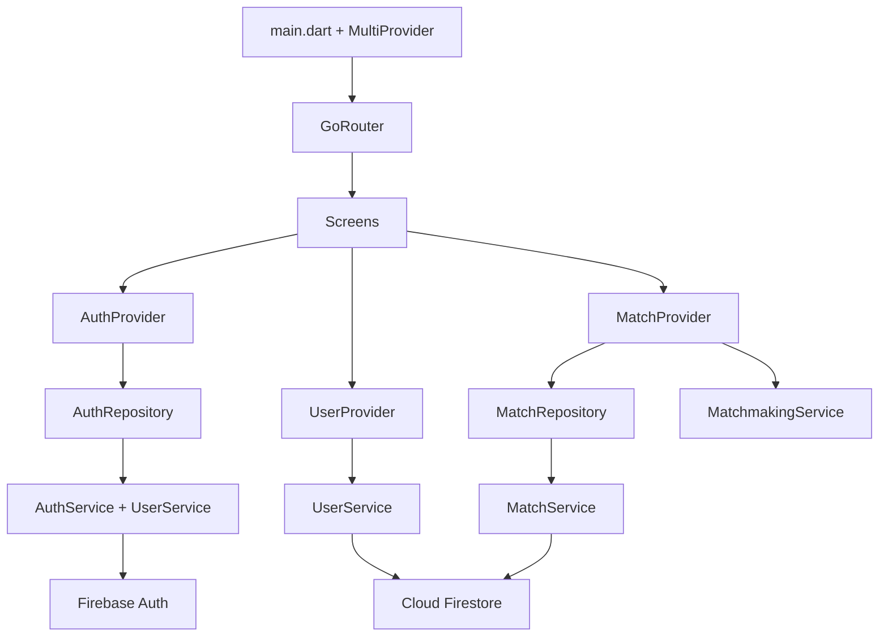

# ineTeam — Build Walkthrough

## Summary

Built a complete Flutter sports matchmaking app for INPT students with **35+ files** across a clean architecture. The app uses **Firebase Auth + Firestore** for backend, **Provider** for state management, **GoRouter** for navigation, and a premium dark/light theme.

## Architecture



## Files Created (35 files)

### Core Layer (5 files)
| File | Purpose |
|------|---------|
| [app_constants.dart](file:///c:/Users/safar/MyProjects-User/ineTeam/lib/core/constants/app_constants.dart) | Enums (SportType, SkillLevel, PlayFrequency, MatchStatus), Firestore collection names, INPT email domain |
| [app_theme.dart](file:///c:/Users/safar/MyProjects-User/ineTeam/lib/core/theme/app_theme.dart) | Premium dark + light themes with Google Fonts (Inter), sport-specific colors |
| [validators.dart](file:///c:/Users/safar/MyProjects-User/ineTeam/lib/core/utils/validators.dart) | Form validation with INPT email domain restriction |
| [helpers.dart](file:///c:/Users/safar/MyProjects-User/ineTeam/lib/core/utils/helpers.dart) | Date formatting, sport icons/colors, skill labels, snackbar utility |
| [app_router.dart](file:///c:/Users/safar/MyProjects-User/ineTeam/lib/core/router/app_router.dart) | GoRouter with auth guards, profile-setup redirect, shell route |

### Data Layer (7 files)
| File | Purpose |
|------|---------|
| [user_model.dart](file:///c:/Users/safar/MyProjects-User/ineTeam/lib/data/models/user_model.dart) | User model with Firestore serialization, `hasCompletedProfile` check |
| [match_model.dart](file:///c:/Users/safar/MyProjects-User/ineTeam/lib/data/models/match_model.dart) | Match model with `isFull`, `spotsLeft`, `hasPlayer` computed properties |
| [auth_service.dart](file:///c:/Users/safar/MyProjects-User/ineTeam/lib/data/services/auth_service.dart) | Firebase Auth wrapper with user-friendly error messages |
| [user_service.dart](file:///c:/Users/safar/MyProjects-User/ineTeam/lib/data/services/user_service.dart) | Firestore CRUD for user profiles + Firebase Storage picture upload |
| [match_service.dart](file:///c:/Users/safar/MyProjects-User/ineTeam/lib/data/services/match_service.dart) | Firestore match operations with **transactions** for atomic joins |
| [auth_repository.dart](file:///c:/Users/safar/MyProjects-User/ineTeam/lib/data/repositories/auth_repository.dart) | Orchestrates auth + profile creation together |
| [match_repository.dart](file:///c:/Users/safar/MyProjects-User/ineTeam/lib/data/repositories/match_repository.dart) | Business logic validation (full match, duplicate join, future dates) |

### Feature Providers (4 files)
| File | Purpose |
|------|---------|
| [auth_provider.dart](file:///c:/Users/safar/MyProjects-User/ineTeam/lib/features/auth/auth_provider.dart) | Auth state, session persistence, profile stream listener |
| [user_provider.dart](file:///c:/Users/safar/MyProjects-User/ineTeam/lib/features/profile/user_provider.dart) | Profile state, updates, picture uploads |
| [match_provider.dart](file:///c:/Users/safar/MyProjects-User/ineTeam/lib/features/matches/match_provider.dart) | Match CRUD, filtering, search, real-time streams |
| [matchmaking_service.dart](file:///c:/Users/safar/MyProjects-User/ineTeam/lib/features/matches/matchmaking_service.dart) | Alternating draft algorithm for team balancing |

### Widgets (7 files)
| File | Purpose |
|------|---------|
| [match_card.dart](file:///c:/Users/safar/MyProjects-User/ineTeam/lib/presentation/widgets/match_card.dart) | Premium card with sport icon, status badge, player progress bar |
| [sport_chip.dart](file:///c:/Users/safar/MyProjects-User/ineTeam/lib/presentation/widgets/sport_chip.dart) | Animated filter chip with sport-specific color |
| [skill_indicator.dart](file:///c:/Users/safar/MyProjects-User/ineTeam/lib/presentation/widgets/skill_indicator.dart) | Circular progress ring with skill rating |
| [player_avatar.dart](file:///c:/Users/safar/MyProjects-User/ineTeam/lib/presentation/widgets/player_avatar.dart) | Avatar with cached network image & skill ring |
| [loading_overlay.dart](file:///c:/Users/safar/MyProjects-User/ineTeam/lib/presentation/widgets/loading_overlay.dart) | Full-screen loading overlay |
| [empty_state.dart](file:///c:/Users/safar/MyProjects-User/ineTeam/lib/presentation/widgets/empty_state.dart) | Empty list placeholder with icon & action |
| [team_balance_view.dart](file:///c:/Users/safar/MyProjects-User/ineTeam/lib/presentation/widgets/team_balance_view.dart) | Two-column team split display |

### Screens (10 files)
| File | Purpose |
|------|---------|
| [splash_screen.dart](file:///c:/Users/safar/MyProjects-User/ineTeam/lib/presentation/screens/splash_screen.dart) | Animated logo with gradient background |
| [login_screen.dart](file:///c:/Users/safar/MyProjects-User/ineTeam/lib/presentation/screens/auth/login_screen.dart) | INPT email login with validation |
| [signup_screen.dart](file:///c:/Users/safar/MyProjects-User/ineTeam/lib/presentation/screens/auth/signup_screen.dart) | Registration with name, email, password |
| [profile_setup_screen.dart](file:///c:/Users/safar/MyProjects-User/ineTeam/lib/presentation/screens/profile/profile_setup_screen.dart) | Sport selection, skill slider, frequency |
| [home_screen.dart](file:///c:/Users/safar/MyProjects-User/ineTeam/lib/presentation/screens/home/home_screen.dart) | Match list with filters, search, FAB |
| [match_detail_screen.dart](file:///c:/Users/safar/MyProjects-User/ineTeam/lib/presentation/screens/match/match_detail_screen.dart) | Full match info, players, join/leave, team balance |
| [create_match_screen.dart](file:///c:/Users/safar/MyProjects-User/ineTeam/lib/presentation/screens/match/create_match_screen.dart) | Sport, location, date/time, max players, skill range |
| [my_matches_screen.dart](file:///c:/Users/safar/MyProjects-User/ineTeam/lib/presentation/screens/match/my_matches_screen.dart) | Tabs for Joined / Created matches |
| [profile_screen.dart](file:///c:/Users/safar/MyProjects-User/ineTeam/lib/presentation/screens/profile/profile_screen.dart) | Profile info, stats, dark mode toggle, logout |
| [main_shell.dart](file:///c:/Users/safar/MyProjects-User/ineTeam/lib/presentation/screens/main_shell.dart) | Bottom nav: Home / My Matches / Profile |

### Modified
| File | Change |
|------|--------|
| [main.dart](file:///c:/Users/safar/MyProjects-User/ineTeam/lib/main.dart) | Rewrote with MultiProvider, GoRouter, theme toggle |
| [pubspec.yaml](file:///c:/Users/safar/MyProjects-User/ineTeam/pubspec.yaml) | Added 8 new dependencies |

### Deleted
- `lib/pages/login_page.dart`
- `lib/pages/home_page.dart`
- `lib/pages/myhomepage.dart`

## Key Features Implemented

1. **🔐 Auth** — Email/password signup & login, INPT domain validation, persistent sessions, error handling
2. **👤 Profiles** — Name, sports, skill level (1-100), frequency, profile picture
3. **🏟️ Match Creation** — Sport, location, date/time, max players, optional skill range
4. **📋 Match Listing** — Real-time Firestore streams, sport filters, search
5. **➕ Join/Leave** — Transaction-based joins preventing race conditions, auto-status updates
6. **⚖️ Team Balancing** — Alternating draft algorithm when match is full
7. **🎨 Premium UI** — Dark/light toggle, Google Fonts, sport-specific colors, animations
8. **🛡️ Edge Cases** — Full match protection, duplicate joins, network errors, form validation

## Verification

- ✅ `flutter analyze` — 0 issues
- ✅ `flutter build web` — Compiled successfully

## How to Run

```bash
# Run on web
flutter run -d chrome

# Run on connected device
flutter run

# Run on Android emulator
flutter run -d emulator-5554
```

## Firebase Setup Required

Your Firebase project `ineteam-2026` is already configured. Make sure these are enabled in the Firebase Console:
1. **Authentication** → Email/Password sign-in provider
2. **Cloud Firestore** → Create database (start in test mode)
3. **Firebase Storage** → Enable (for profile pictures)

### Firestore Security Rules (recommended for production)
```
rules_version = '2';
service cloud.firestore {
  match /databases/{database}/documents {
    match /users/{userId} {
      allow read: if request.auth != null;
      allow write: if request.auth != null && request.auth.uid == userId;
    }
    match /matches/{matchId} {
      allow read: if request.auth != null;
      allow create: if request.auth != null;
      allow update: if request.auth != null;
      allow delete: if request.auth != null && 
        resource.data.creatorId == request.auth.uid;
    }
  }
}
```
